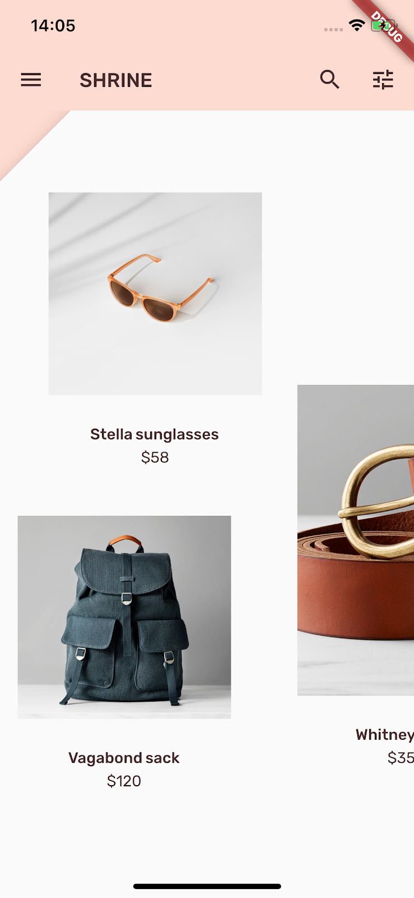

# Material Design and Material Components - Shrine Project

A new Flutter project for [MDC on codelabs](https://codelabs.developers.google.com/codelabs/mdc-101-flutter/index.html).

본 저장소는 구글 코드랩스의 MDC 강의를 따라하는 저장소입니다. 따라 하는 중에 이슈들에 대해 한글로 정리 합니다. 강의 전체에 대한 번역은 시간이 오래 걸리는 관계로 생략합니다.

각각의 커밋에 어떤 내용이 수정되었는지 표기합니다. 대부분은 스텝별로 커밋을 수행합니다.

플러터 기본 정보는 [Getting Started](#Getting-Started)를 참조

## MDC 전체 목록

- [MDC 101 - Material Components Basics](https://codelabs.developers.google.com/codelabs/mdc-101-flutter/index.html#0)
- [MDC 102 - Material Design Structure and Layout](https://codelabs.developers.google.com/codelabs/mdc-102-flutter/)
- [MDC 103 - Material Design Theming with Color, Shape, Elevation and Type](https://codelabs.developers.google.com/codelabs/mdc-103-flutter)
- [MDC 104 - Material Design Advanced Components](https://codelabs.developers.google.com/codelabs/mdc-104-flutter)
- [코드 이해하기](#코드-이해하기)
  - [MDC-101](#MDC-101)
  - [MDC-102](#MDC-102)
  - [MDC-103](#MDC-103)
  - [MDC-104](#MDC-104)

## 플러터의 메테리얼 디자인과 메테리얼 컴포넌트

**메테리얼 디자인**은 선명하고 아름다운 디지털 제품을 만들기 위한 디자인 시스템이다.
**플러터의 메테리얼 컴포넌트 (MDC-Flutter)**는 다양한 플랫폼에서 앱 전반에 걸쳐 일관적인 유저 경험을 제공하기 위해 제작된 플러터 컴포넌트 라이브러리이다. 어느 환경에서나 픽셀-퍼펙트한 뷰 구현을 지원하도록 제작되며, 구글의 프론트 엔드 개발 표준에 따라서 항상 업데이트 된다. MDC는 안드로이드 뿐만 아니라 iOS 및 웹도 지원한다. 

## 본 저장소의 프로젝트

본 프로젝트에서는 간단한 e-commerce 앱을 만들게 된다. 이를 통해 MDC-Flutter의 사용법과 각 개인의 브랜드와 스타일을 효율적으로 뷰에 표현하는 기술을 습득한다. 프로젝트는 총 [4가지 단계](#MDC-전체-목록)로 구분된다.

최종 앱의 형태는 아래 그림과 같다.


## 코드 이해하기

### MDC-101

코드 분석의 순서는 프로젝트에서 코드 수정을 진행하는 순서대로 한다. 이미 [Startup Namer - First Flutter App](https://github.com/flutter-tutorial/startup_namer) 프로젝트를 수행하고 왔다는 가정하에 자세한 설명은 생략한다. 첫 프로젝트를 하지 않은 개발자의 경우에는 위의 첫 프로젝트를 먼저 진행하면서 기본 구조를 확인하고 **Shrine** 프로젝트를 수행하길 권장한다. 

#### lib/main.dart

플러터를 사용한 프로젝트의 시작점은 모두 `main.dart`의 `main` 함수이다. MDC 프로젝트의 `lib/main.dart` 코드를 보면 앱의 실행을 위해 `runApp(ShrineAPP());` 을 수행하고 메인 함수를 종료함을 알 수 있다. 이 때 `ShrineApp()` 클래스는 `import 'package:Shrine/app.dart'`를 통해 임포트한 모듈에 존재 한다. `app.dart`를 임포트 할 때 `Shrine` 패키지 명을 사용할 수 있는 이유는 프로젝트의 `pubspec.yaml` 에 프로젝트 패키지 이름을 `Shrine`으로 지정했기 때문이다. 경우에 따라서 상대경로를 사용해도 된다. 

#### lib/login.dart

`login.dart` 코드는 크게 2개의 클래스로 구분이 된다. 실제로 뷰를 표시해주는 `StatefulWidget` 클래스인 `LoginPage`와 그를 위한 `State` 클래스 인 `_LoginPageState` 클래스이다. 기본적으로 작성되어 있는 내용은 단순히 로고를 표시하기 위한 내용이다. 

[MDC-101](#MDC-101)에서는 간단한 텍스트 필드와 버튼을 추가하고, 라우팅을 경험해보는 정도로만 끝이난다. `_LoginPageState` 클래스의 `build` 메소드 내에서 실제 내용을 표기해주는 `ListView` 위젯 안에 필요한 텍스트 필드와 버튼을 추가하였다. 위 아래 위젯 간의 간격을 위해 `SizedBox` 클래스를 사용하였고, 유저 아이디 및 비밀번호 입력을 위해 `TextField` 위젯을 사용하였다. 버튼은 여러 종류가 있으나 그 중 `FlatButton` 과 `RaisedButton`을 사용하였으며 버튼의 수평 정렬과 일정한 디자인을 위해 `ButtonBar` 위젯을 사용하였다 .

메테리얼 디자인 컴포넌트에서 제공하는 `TextField`는 `decoration` 필드를 통해 `InputDecoration` 위젯으로 설정할 경우 자연스럽게 이동되는 label을 설정할 수 있다. 또한 텍스트 필드 내의 텍스트 들에 대한 컨트롤을 위해서 `controller` 필드에 `TextEditingController()`를 할당하여 사용한다. 

버튼을 한가지의 종류가 아닌 두가지의 종류로 나눈 이유는 사용자 경험을 높이기 위해서이다. 로그인 페이지에서 중요한 이벤트는 로그인 한 뒤 다음 이벤트로 넘어가는 것이므로 상대적으로 CANCEL 보다는 NEXT 가 중요한 이벤트이다. 이를 위해 CANCEL 버튼은 단순 텍스트만 표시되는 `FlatButton` 위젯으로, NEXT 버튼은 뷰와 대비되어 클릭 가능한 버튼으로 명시적으로 보이도록 `RaisedButton` 위젯으로 설정해서 사용자의 시선을 집중시키도록 하였다. 

*CANCEL* 버튼을 누르면 입력한 데이터를 모두 지우기 위해 텍스트 필드에 할당한 `controller`들을 이용하여 텍스트 필드를 삭제하였다. 

```dart
_usernameController.clear();
_passwordController.clear();
```
*NEXT* 버튼을 누르면 로그인이 완료되고 홈 화면으로 돌아가도록 플러터의 네비게이터에서 현재 로그인 화면을 `pop` 시켰다. 
```dart
Navigator.pop(context);
```
위의 코드를 통해 home 화면으로 돌아갈 수 있는 이유는 `Navigator`의 스택구조 덕분이다. `app.dart` 코드를 보면 `home` 필드가 `HomePage()` 위젯으로 지정되어 있고, `initialRoute: '/login'` 필드를 통해 홈 화면에서 곧바로 `login` 페이지로 가도록 설정한 것을 볼 수 있다. 이로 인해 네비게이션 스택에 [HomePage][LoginPage] 가 쌓이게 되고, `LoginPage`에서 `pop` 할 경우 [HomePage] 만이 스택에 남아있게 된다. 실제 라우터 설정은 `app.dart` 코드의 `_getRounte()` 메소드를 직접 분석하고 자료를 찾아보길 추천한다. 

### MDC-102

#### home.dart

기본 코드에서 `home.dart`에는 단순히 사용자에게 "You did it!" 만 표시하고 있다. 완전한 Shrine 앱을 만들기 위해서는 일단 기본적인 2가지가 필요하다.
1. 앱의 상단에 앱바를 추가한다.
	- 앱 바에는 앱 드로워 메뉴 버튼, 앱 타이틀, 검색 버튼, 필터 버튼이 필요하다
2. 화면에 카드 형태의 상품 목록을 보여준다
	- 상품 목록은 이미지 / 타이틀 / 가격의 형태로 구성된다.

##### 앱바 추가하기

상단 부 앱 바는 `home.dart`의 메인뷰에 위치하므로 `build` 메소드에 바로 코드 수정을 한다. 뷰 전체를 보여주는 `return Scaffold()` 안에 `appBar` 필드를 추가하여 표시할 수 있다. 실제 코드는 저장소의 [lib/home.dart](lib/home.dart) 코드를 확인하도록 하고 여기서는 간단한 설명만 진행한다.

`appBar`의 `leading` 필드는 이름 그대로 최우선적인 위치에 표시되는 위젯을 선언하는 필드이다. `title` 필드는 앱바에 표기될 앱이나 뷰의 이름이다. `actions` 필드는 `leading`과 반대되는 개념으로 최후방에 표시되는 위젯을 선언하는 것으로 trailing이라고도 불린다. 

##### 카드 화면 추가하기

기존에 표시되어 있는 "You did it!" 을 상품 카드로 표시하기 위해서는 몇가지 작업이 필요하다. 
1. 자동으로 스크롤 되면서 일정한 크기의 카드를 표시
	- `GridView` 위젯을 사용할 수 있다.
2. 필요한 만큼의 카드 리스트를 생성 

본 프로젝트에서는 카드 리스트를 생성하기 위해서 따로 프라이빗 메소드 `_buildGridCards`를 만들어 카드 생성 코드의 중복을 회피하였다. 실제 코드는 역시나 [저장소](lib/home.dart)에서 확인하기 바란다. 

여기서 `AspectRatio` 위젯은 이름에서 추측할 수 있듯이, 표기할 위젯의 가로/세로 비율을 지정하는 위젯이다. `Image` 위젯에서 `fit` 필드는 해당 이미지의 크기를 어떤 방식으로 조절할 것 인지를 지정한다. 본 프로젝트에서 사용한 `BoxFit.fitWidth`는 이미지를 가로로 늘려 컨테이너의 크기에 맞춘다는 의미이다. 

### MDC-103

#### pubspec.yaml

MDC 세번째 강의에서는 폰트를 설정하고 테마를 바꾸는 작업을 위주로 진행한다. 이를 위해 앱에서 사용할 폰트를 추가해야한다. 폰트를 추가하는 방법은, 일단 앱 프로젝트의 원하는 폴더에 사용하고자 하는 폴더를 복사한뒤 `pubspec.yaml` 파일에 폰트 정보를 추가해야한다. MDC 에서 제공하는 기본 프로젝트 파일에 이미 `fonts/Rubik-Regular.ttf` 와 `fonts/Rubik-Medium.ttf` 파일이 포함되어 있다. 이를 애플리케이션에서 사용하기 위해서는 아래의 코드를 `pubspec.yaml`의 `flutter:` 필드에 `fonts` 레이어를 추가해야 한다. 이때 탭 대신에 띄어쓰기 2개로 필드의 레이어를 구분해야 한다.

```yaml
flutter:
  fonts:
    - family: Rubik
    fonts:
      - asset: fonts/Rubik-Regular.ttf
      - asset: fonts/Rubik-Medium.ttf
        weight: 500
```

#### colors.dart

이 파일에는 앱에서 사용할 색 정보를 저장한다. 특별히 설명할 코드가 없으므로 실제 코드는 직접 보길 바란다. Color() 위젯에는 16진수로 ARGB를 표현하면 된다. 직접 색을 설정하지 않고 material이 제공하는 기본 색을 사용할 수도 있다. 이 때에는 `Colors` 클래스의 데이터를 사용한다. `Color.white`와 같이 바로 색을 사용할 수도 있고, `Colors.pink[400]`과 같이 어두운 정도를 결정할 수 있다.

#### app.dart

`app.dart` 파일에서 수정된 코드는 주로 테마 설정 부분이므로 생략한다. 그중 기존 테마를 가져와서 원하는 필드만 바꾸는 `copyWith()` 메소드가 가장 중요하다. 거의 모든 위젯에 포함되어 있는 클래스로, 복사하고자 하는 클래스의 모든 속성을 그대로 가져 오면서 특정 필드의 속성만 바꿀 수 있는 중요한 메소드이다. 

## Getting Started

This project is a starting point for a Flutter application.

A few resources to get you started if this is your first Flutter project:

- [Lab: Write your first Flutter app](https://flutter.io/docs/get-started/codelab)
- [Cookbook: Useful Flutter samples](https://flutter.io/docs/cookbook)

For help getting started with Flutter, view our 
[online documentation](https://flutter.io/docs), which offers tutorials,
samples, guidance on mobile development, and a full API reference.
